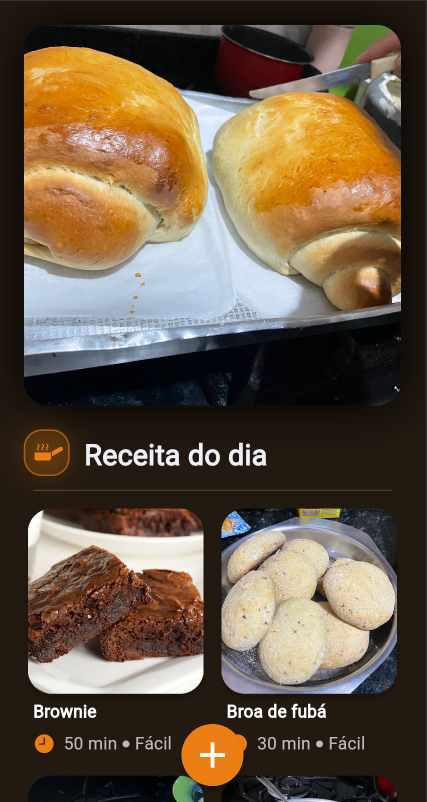
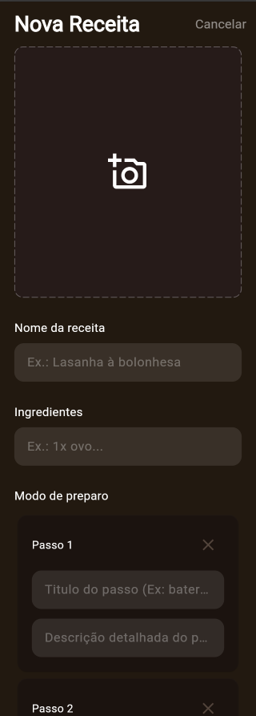
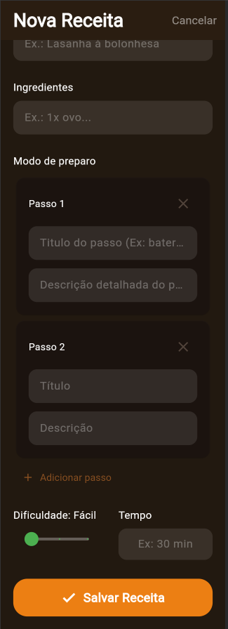

# Soulmates Recipes - App de Receitas 🍳🥗


## 📝 Descrição

**Soulmates Recipes** é um aplicativo para dispositivo móvel construído com Flutter, pensado para quem quer compartilhar receitas com uma pessoa querida. Ele funciona como um livro de receitas digital, permitindo que os usuários salvem e consultem suas receitas favoritas de forma fácil e organizada.

Este foi o meu primeiro projeto. Minha ideia foi aprender, então existem muitas coisas para melhorar. Com este projeto aprendi muito sobre muitos widgets, sobre algumas bibliotecas, sobre integração com serviçoes de backend como o Supabase, que me ajudou muito e me deu armazenamento gratuito, e comecei a aplicar os conhecimentos em desenvolvimento mobile com Flutter.

## ✨ Funcionalidades

- [x] **Visualização de Receitas:** Navegue por uma lista de receitas com fotos e nomes.
- [x] **Detalhes da Receita:** Toque em uma receita para ver os ingredientes e o modo de preparo completos.
- [x] **Adicionar Receitas:** Crie e salve novas receitas no banco de dados, incluindo uma foto.
- [x] **Remover Receitas:** Apague receitas que não deseja mais.
- [x] **Receita do dia:** Receba uma recomendação de receita do aplicativo com base nas suas receitas.
- [ ] **(Futuro) Edição de Receitas:** Modificar receitas já existentes.
- [ ] **(Futuro) Busca e favoritos:** Pesquisar receitas por ou acessar a aba de favoritos.

## 📸 Telas do Aplicativo


| Tela Principal |


| Detalhes da Receita |
  

| Adicionar Receita |
|   |


## 🚀 Tecnologias Utilizadas

- **Flutter:** Framework para desenvolvimento de interfaces de usuário nativas e multiplataforma.
- **Dart:** Linguagem de programação utilizada pelo Flutter.
- **Supabase:** Plataforma de Backend-as-a-Service, utilizada para:
  - **Database:** Armazenamento das informações das receitas.
  - **Storage:** Salvamento das fotos das receitas.

## ⚙️ Como Executar o Projeto

Para rodar este projeto em sua máquina, siga os passos abaixo:

1.  **Clone o repositório:**
    ```sh
    git clone https://github.com/Isac-Raimundo/SoulmatesRecipes.git
    cd SoulmatesRecipes
    ```

2.  **Instale as dependências do Flutter:**
    ```sh
    flutter pub get
    ```
3. **Crie seu banco de dados no Supabase:**
   - Na configuração do Supabase, utilize os nomes usados no código:
   - Database (tables): `notes`
   - colunas: `id` (int8), `created_at` (timestamptz), `nome` (text), `ingredientes` (text), `preparo` (text), `imagem` (text), `dificuldade` (text),`tempo` (text).

4. **Configure suas credenciais do Supabase:**
    - Na pasta `lib/`, renomeie o arquivo `supabase_options.example.dart` para `supabase_options.dart`.
    - Abra o arquivo `supabase_options.dart` e preencha com a sua `url` e `anonKey` do Supabase.

5. **Execute o aplicativo:**
    ```sh
    flutter run
    ```

---

Desenvolvido com ❤️ por [Isac Raimundo](https://github.com/Isac-Raimundo).

Aceito dicas, obrigado.